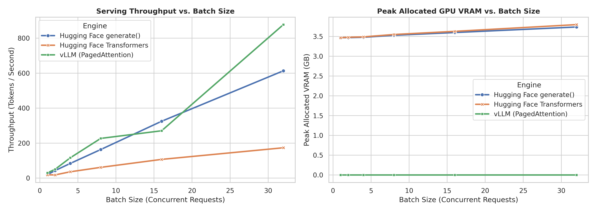

# vLLM PagedAttention vs. Hugging Face Transformers

## Empirical Inference & KV Cache Optimization

[](https://www.python.org/)
[](https://www.nvidia.com/)
[](LICENSE)
[](#reproducing-the-experiment)

### 🚀 At a Glance

* **Core Achievement:** Demonstrated up to **5.06× throughput gains** using vLLM's PagedAttention at batch size 32 compared to the Hugging Face baseline.
* **Mechanism:** Bypassed traditional contiguous KV-cache allocation fragmentation by implementing block-level virtual memory mapping.
* **Environment:** Validated on an NVIDIA Tesla T4 using Google Colab & Kaggle notebooks.

This project studies how inference runtimes manage the key–value (KV) cache during autoregressive generation. It compares vLLM with Hugging Face `generate()` using variable-length prompts, increasing batch sizes, and fixed-length decoding on a Tesla T4-class GPU.

> **Key takeaway:** In the checked-in measurements, vLLM reaches **877.69 generated tokens/s at batch size 32**, versus **173.45 tokens/s** for the Hugging Face Transformers row in the combined results. The comparison is an empirical notebook study, not a controlled serving benchmark: runtime versions, run conditions, and VRAM instrumentation need to be made consistent before drawing general conclusions.

## Project overview

Autoregressive inference repeatedly attends to the tokens generated so far. The KV cache stores the attention keys and values for those tokens, avoiding recomputation at every decode step. As requests grow and finish at different times, cache demand changes dynamically; the cache can become a major part of inference memory and constrain how many sequences fit on a GPU. In some serving configurations, KV-cache capacity can account for a substantial fraction of usable GPU memory.

Traditional contiguous allocation reserves a large tensor region per sequence, often sized for a maximum length or otherwise difficult to grow efficiently. Short requests can leave reserved capacity unused, while variable request lengths complicate allocation and can cause fragmentation. vLLM's **PagedAttention** divides the KV cache into fixed-size logical blocks and maps them to non-contiguous physical GPU blocks as generation proceeds. This borrows the indirection and allocation principles of virtual memory to reduce wasted cache capacity and support higher concurrency.

The design is based on the foundational paper [*Efficient Memory Management for Large Language Model Serving with PagedAttention*](https://arxiv.org/abs/2309.06180) by Kwon et al. (SOSP 2023). This repository is a small, reproducible empirical exploration of those memory-management principles; it is not a reproduction of the paper's full system or evaluation.

## Architecture and implementation

| Concern | Hugging Face baseline | vLLM path |
| --- | --- | --- |
| Generation API | PyTorch model with Transformers `generate()` | vLLM `LLM.generate()` |
| KV-cache handling | Model/runtime-managed cache allocation | PagedAttention block-managed KV cache |
| Scheduling | Batched generation calls | vLLM engine scheduling and batching |
| Current benchmark model | `Qwen/Qwen2.5-1.5B-Instruct` | `Qwen/Qwen2.5-1.5B-Instruct` |

The benchmark notebook configures **vLLM Engine V0** (`VLLM_USE_V1=0`), a 16-token cache block, eager execution, FP16, a 2,048-token model context limit, and 0.80 GPU memory utilization. The separate Kaggle notebook contains exploratory `Llama-3.2-1B-Instruct` loading/generation cells, but those are not the model used for the checked-in vLLM comparison. The repository does not currently establish a measured Engine V1 result.

**Technology:** Python, PyTorch, vLLM, Hugging Face Transformers, Pandas, Seaborn, and Matplotlib. The available run metadata records Python 3.13.15, PyTorch 2.11.0+cu128, CUDA 12.8, and an NVIDIA Tesla T4. These are recorded environment details, not pinned installation requirements.

## Benchmark setup and workload

- **Hardware:** NVIDIA Tesla T4 in Google Colab and Kaggle notebook environments.
- **Batch sizes:** 1, 2, 4, 8, 16, and 32 requests.
- **Prompts:** a repeating set of short, medium, and long prompts.
- **Decode length:** up to 128 new tokens per request, greedy decoding (`temperature=0` for vLLM; `do_sample=False` for Transformers).
- **Recorded metrics:** aggregate generated-token throughput (tok/s), request rate (req/s), aggregate seconds per generated token per request, and PyTorch allocated/reserved VRAM where captured.

Throughput and request rate are aggregate batch measurements. “Agg Sec/Tok/Req” is elapsed batch time divided by generated tokens per request; it is not a per-token latency distribution and does not include TTFT, TPOT, or P95/P99 latency.

## Results

The table below uses the Hugging Face Transformers and vLLM rows in [`final_vllm_vs_hf_benchmark.csv`](final_vllm_vs_hf_benchmark.csv). Values are transcribed from the checked-in artifact.

| Batch | HF throughput (tok/s) | vLLM throughput (tok/s) | vLLM / HF | HF req/s | vLLM req/s | HF agg sec/tok/req | vLLM agg sec/tok/req | HF peak allocated VRAM (GB) | vLLM peak allocated VRAM (GB) |
| ---: | ---: | ---: | ---: | ---: | ---: | ---: | ---: | ---: | ---: |
| 1 | 18.77 | 30.05 | 1.60× | 0.15 | 0.23 | 0.0533 | 0.0333 | 3.47 | Not captured |
| 2 | 18.19 | 50.13 | 2.76× | 0.14 | 0.39 | 0.1099 | 0.0399 | 3.48 | Not captured |
| 4 | 36.04 | 116.06 | 3.22× | 0.28 | 0.91 | 0.1110 | 0.0345 | 3.49 | Not captured |
| 8 | 61.42 | 226.98 | 3.70× | 0.48 | 1.77 | 0.1303 | 0.0352 | 3.55 | Not captured |
| 16 | 107.00 | 270.61 | 2.53× | 0.84 | 2.11 | 0.1495 | 0.0591 | 3.63 | Not captured |
| 32 | 173.45 | 877.69 | 5.06× | 1.36 | 6.86 | 0.1845 | 0.0365 | 3.80 | Not captured |

The combined CSV also includes a second Hugging Face measurement labeled `Hugging Face generate()`. At batch 32 it records 613.65 tok/s, so the vLLM result is 1.43× that row. The two HF entries are retained in the data because they come from separate benchmark paths/runs; they should not be silently treated as interchangeable replicates. The baseline to use depends on the question being asked.

### Interpretation and limits

The measured throughput increases with batch size for both runtimes, with vLLM ahead of the selected Transformers row at every listed batch size. At larger batches, vLLM's paged cache and serving scheduler can use GPU memory more effectively: block allocation avoids reserving one contiguous maximum-length cache per request, and block tables map logical sequence positions to physical KV blocks. This helps explain the observed scaling, though this benchmark does not isolate PagedAttention from other runtime differences such as scheduling, kernels, and batching.

VRAM values for vLLM in the CSV are **0.0**, not evidence of zero memory use. PyTorch's allocator counters do not account for all memory managed by vLLM/CUDA, and the current notebook records zero for these counters. Accordingly, the plot's vLLM VRAM series is not a valid memory comparison. The HF figures are PyTorch allocated memory, not total device usage. A defensible memory comparison requires measuring both processes with a common device-level method and recording peak values after warmup.

The runs were performed in notebook environments and the artifacts do not provide enough controls to claim strict apples-to-apples timing. Treat the numbers as observed results for this workload and environment, not universal performance guarantees. Repeated trials, fixed software versions, a shared benchmark harness, and device-level memory sampling would strengthen the comparison.

### Comparative visualization



The throughput panel reflects the stored measurements. The peak VRAM panel should be read with the instrumentation limitation above; vLLM's zeros are missing/uncaptured measurements rather than actual usage.

## Repository structure

```text
.
├── vllm_vs_hf_benchmark.ipynb       # Colab-oriented vLLM run and comparison workflow
├── vllmproject.ipynb                # Kaggle exploration and Hugging Face benchmark notebook
├── final_vllm_vs_hf_benchmark.csv   # Combined HF and vLLM measurements
├── vllm_results.csv                 # vLLM measurements
├── results/
│   ├── benchmark_results.csv        # Hugging Face benchmark measurements
│   ├── run_metadata.csv             # Recorded Python/PyTorch/CUDA/GPU metadata
│   ├── vllm_vs_hf_benchmark.png      # Kaggle notebook plot
│   └── __results___files/           # Notebook-exported image artifact
├── vllm_vs_hf_final_comparison.png   # Combined throughput and VRAM plot
├── LICENSE
└── readme.md
```

## Reproducing the experiment

1. **Choose a GPU notebook runtime.** Open `vllm_vs_hf_benchmark.ipynb` in Colab with a Tesla T4-class GPU for the vLLM run. The Hugging Face baseline notebook is `vllmproject.ipynb` and was developed for Kaggle. GPU availability and notebook package versions vary over time.
2. **Inspect the configuration before running.** The benchmark uses Qwen2.5-1.5B-Instruct, batch sizes `[1, 2, 4, 8, 16, 32]`, variable prompts, and up to 128 generated tokens. The vLLM notebook installs its dependencies in the notebook and configures Engine V0 for the T4 workflow.
3. **Run the baseline and vLLM measurements.** Execute the relevant benchmark cells in their intended GPU runtime. Save each environment's `benchmark_results.csv` or `vllm_results.csv` output.
4. **Combine and plot results.** In the vLLM notebook, place the HF `benchmark_results.csv` and vLLM `vllm_results.csv` in the working directory and run the comparison cell. It writes `final_vllm_vs_hf_benchmark.csv` and `vllm_vs_hf_final_comparison.png`.
5. **Inspect the checked-in artifacts.** The CSVs and plots let you review the recorded run without provisioning a GPU. `results/run_metadata.csv` records the available runtime metadata.

Model access and notebook-specific setup can require a Hugging Face account/token. Supply credentials through the notebook runtime's secret manager or environment variables; do not commit access tokens into notebooks or source control.

## Future Iterations & Roadmap

- [ ] Standardize VRAM metrics capture using `pynvml` or device-level DCGM counters rather than relying solely on PyTorch allocators.
- [ ] Benchmark vLLM **Engine V1** stability on Ampere/L4 GPUs.
- [ ] Expand request arrivals to asynchronous Poisson distributions using async clients to simulate real-world production traffic spikes.

## Research reference

> Kwon, W. et al. “Efficient Memory Management for Large Language Model Serving with PagedAttention.” *Proceedings of the 29th Symposium on Operating Systems Principles (SOSP 2023).* [arXiv:2309.06180](https://arxiv.org/abs/2309.06180).

## License

Released under the [MIT License](LICENSE).
